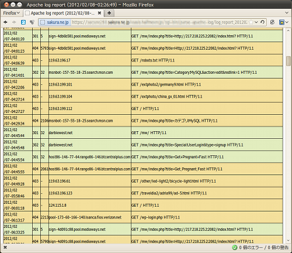
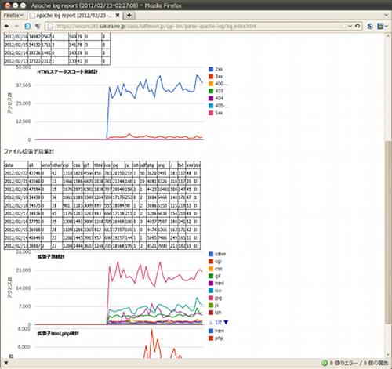

## Apache Webサーバのログからエラー行を抽出してHTML化するPerlスクリプト (Linux, BSD)<!-- omit in toc -->

[Home](https://oasis3855.github.io/webpage/) > [Software](https://oasis3855.github.io/webpage/software/index.html) > [Software Download](https://oasis3855.github.io/webpage/software/software-download.html) > [webserver_tools](../README.md) > ***apache-log-html-converter*** (this page)

<br />
<br />

Last Updated : Feb. 2012 -- ***this is discontinued software 開発終了***

- [ソフトウエアのダウンロード](#ソフトウエアのダウンロード)
- [概要](#概要)
  - [設定ファイル（parse-apache-log.config.pl）](#設定ファイルparse-apache-logconfigpl)
  - [自動で作成されるファイル類](#自動で作成されるファイル類)
- [動作確認済み](#動作確認済み)
- [バージョン情報](#バージョン情報)
- [ライセンス](#ライセンス)

<br />
<br />

## ソフトウエアのダウンロード

-    [このGitHubリポジトリを参照する（ソースコード, 実行ファイル）](../apache-log-html-converter/) 

## 概要

Apache Webサーバより出力されたsyslogから、HTTPリザルトコード300以上のもの及びエラーログを抽出し、見やすいHTML形式に成形するPerlスクリプト。cronで毎日のログローテーション後に実行する自動化ツールとして作成しています。

作成されるHTMLファイルは2種類あり、ひとつは「指定した1日分のエラーが発生したアクセスログ」、もうひとつは「日毎の統計データをグラフ化」したものです。



指定した1日分のエラーが発生したアクセスログ（HTTPリザルトコードの300番台、400番台… を別の色で着色したもの）をブラウザで表示させた例



日毎の統計データをグラフ化してブラウザで表示させた例

### 設定ファイル（parse-apache-log.config.pl）

ディレクトリなどはユーザ環境に合わせて修正する。また、日毎の統計データの集計をするためのファイル拡張子やリザルトコードの指定もここで行う。

```Perl
##### GLOBAL CONFIG VALUE #####
# LOG directory
our $log_directory = './var/log/';
# LOG file pattern ( string for sprintf('name%d%d%d', $y, $m, $d) )
our $log_filename_template = 'access_log_%04d%02d%02d';
# ERROR_LOG file pattern ( string for sprintf('name%d%d%d', $y, $m, $d) )
our $errorlog_filename_template = 'error_log_%04d%02d%02d';
# Output directory
our $output_directory = './var/www/';
# Output file pattern ( string for sprintf('name%d%d%d', $y, $m, $d) )
our $output_filename_template = 'log_report_%04d%02d%02d.html';
# Output files index filename
our $output_index_filename = 'log_index.html';
# Error Message Log Output (in Output directory)
our $error_message_filename = 'log_report_error.txt';
# use Compress::Zlib =1, not use (use gunzip command)=0
our $flag_use_zlib = 0;
##### GLOBAL CONFIG VALUE #####

##### STAT HASH #####
our %stat_ext = ('ext_html'=>{disp=>'html', count=>0, pattern=>'.htm$|.html$|.shtml$'},
        'ext_php'=>{disp=>'php',  count=>0, pattern=>'.php$'},
        'ext_cgi'=>{disp=>'cgi',  count=>0, pattern=>'.cgi$'},

～ 省略 ～

        'ext__all'=>{disp=>'all',  count=>0, pattern=>''}
        );
our %stat_statuscode = ('code_2xx'=>{disp=>'2xx', count=>0, min=>200, max=>299},
        'code_3xx'=>{disp=>'3xx',  count=>0, min=>300, max=>399},

～ 省略 ～

```

### 自動で作成されるファイル類

- log_report_20220705.html  &nbsp;&nbsp;&nbsp;&nbsp;&nbsp;&nbsp;&nbsp;&nbsp;&nbsp;&nbsp;  : 指定した1日分（例：2022/07/05）のエラーリスト
- log_index.html  &nbsp;&nbsp;&nbsp;&nbsp;&nbsp;&nbsp;&nbsp;&nbsp;&nbsp;&nbsp;&nbsp;&nbsp;&nbsp;&nbsp;&nbsp;&nbsp;&nbsp;&nbsp;&nbsp;&nbsp;&nbsp;&nbsp;&nbsp;&nbsp;&nbsp;&nbsp;&nbsp;&nbsp;&nbsp;  : 日毎の統計データ
- log_report_error.txt  &nbsp;&nbsp;&nbsp;&nbsp;&nbsp;&nbsp;&nbsp;&nbsp;&nbsp;&nbsp;&nbsp;&nbsp;&nbsp;&nbsp;&nbsp;&nbsp;&nbsp;&nbsp;&nbsp;&nbsp;&nbsp;  : parse-apache-log.pl実行時のエラー
- parse-apache-log.pl.sqlite  &nbsp;&nbsp;&nbsp;&nbsp;&nbsp;&nbsp;&nbsp;&nbsp;&nbsp;&nbsp;&nbsp;  : 日毎の統計データを格納するSQLite3 DB

## 動作確認済み

- Free BSD 9.1, Perl 5.14
- Ubuntu 18.04, Perl 5.30

## バージョン情報

- Version 0.1 (2012/02/04)

  - 当初 

- Version 0.2 (2012/02/07)

  - エラーログ対応 
  - リザルトコード別集計・拡張子別集計 

- Version 0.3 (2012/02/20)

  - 統計データをsqlite3データベースに格納 

- Version 0.4 (2012/02/21)

  - Google Visualization グラフ 


## ライセンス

このスクリプトは [GNU General Public License v3ライセンスで公開する](https://gpl.mhatta.org/gpl.ja.html) フリーソフトウエア

