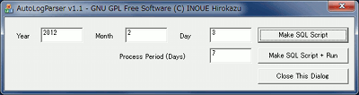

## AutoLogParser（IIS/ApacheログをMicrosoft Log Parserで解析する自動化スクリプト生成ツール）(Windows)<!-- omit in toc -->

[Home](https://oasis3855.github.io/webpage/) > [Software](https://oasis3855.github.io/webpage/software/index.html) > [Software Download](https://oasis3855.github.io/webpage/software/software-download.html) > [webserver_tools](../README.md) > ***auto_logparser*** (this page)

<br />
<br />

Last Updated : Feb. 2012 -- ***this is discontinued software 開発終了***

- [ソフトウエアのダウンロード](#ソフトウエアのダウンロード)
- [概要](#概要)
  - [GUIで手動実行する](#guiで手動実行する)
  - [コマンドラインから実行する](#コマンドラインから実行する)
  - [設定ファイル（AutoLogParser.ini）について](#設定ファイルautologparseriniについて)
  - [作成されるSQLスクリプトファイル（sql_err.sql）の例](#作成されるsqlスクリプトファイルsql_errsqlの例)
- [動作確認済み](#動作確認済み)
- [バージョン情報](#バージョン情報)
- [ライセンス](#ライセンス)

<br />
<br />

## ソフトウエアのダウンロード

-    [このGitHubリポジトリを参照する（ソースコード, 実行ファイル）](../auto_logparser/) 

-    [Googleドライブを参照する（ソースコード, 実行ファイル）](https://docs.google.com/open?id=0B7BSijZJ2TAHNzlhNWMxNmUtYmNjOS00ZjI5LTk0MWEtYTM3MmU0ZTEyNGI0) 

## 概要

IISログ（W3C拡張形式/IIS方式）またはApache Web Serverログ（NCSA形式）をMicrosoft Log Parserを用いて解析するための自動化補助プログラムです。

設定ファイル（AutoLogParser.ini）の各項目を、ユーザ環境に合わせて調整してください。

LogParser実行用のバッチファイルと、そのバッチファイルから呼ばれるLogParser用のSQLファイルが生成されます。

SQLファイルは、「404や500などのHTTPエラーの場合を抜き出す」「GETとPOST以外のリクエスト行」「ステータス・コード別の集計」「リクエスト・メソッド別の集計」の4つが作成されます。

LogParserで、これら4つのクエリが実行された後、結果のファイルをひとつのファイル（ファイル名はINIファイルで設定可能）に結合します。

サーバの監視状況により、これらの集計方法を変える場合は、ソースを変更して再コンパイルしてください。

タスクスケジューラ等で自動実行する場合は、「AutoLogPerser.exe /auto」というように、コマンドパラメータを何か付けてください。コマンドパラメータがついている場合は、INIファイルの内容に従い、本日から7日以内のデータを集計対象として自動実行されます。


### GUIで手動実行する



AutoLogparser実行画面

### コマンドラインから実行する

引数を何かつけると、設定ファイル（AutoLogParser.ini）の設定値でMicrosoft Log Parserを実行します。

タスクスケジューラなどで自動実行・定期実行する場合はこの方法を用います。

```
AutoLogParser.exe /auto
```


### 設定ファイル（AutoLogParser.ini）について

プログラムを初めて実行すると、自動的に設定ファイル（AutoLogParser.ini）のテンプレートが同じディレクトリに作成されます。これをユーザ環境に合わせて編集します。

```INI
[AutoLogParser]
install=installed (do not delete this line)
OutputDir=c:\var\www\             ← 結果出力ディレクトリ
OutputFilename=report.txt         ← 結果出力ファイル名
OutputType=NAT                    ← 出力形式（CSVも指定可）
LogParserDir=h:\Program Files\Microsoft Log Parser\
LogParserProgName=logparser.exe
LogDir=c:\var\log\httpd\          ← 解析対象ログファイルのディレクトリ
LogNameTemplate=access_log_%04d%02d%02d    ← ログファイルの形式
LogType=NCSA                      ← ログ形式（IISのときはIISW3C, ApacheのときはNCSA）
[Readme]
;LogType selection=IIS/IISW3C/NCSA (Apache=NCSA)
;OutputType selection=NAT/CSV
```

### 作成されるSQLスクリプトファイル（sql_err.sql）の例

```SQL
select
	*

into
	c:\var\www\iislog_err.txt

from
       access_log_20120208,
       access_log_20120209 

where
	StatusCode>400
```


## 動作確認済み

- Windows 2003 Server
- Windows XP
- Microsoft Log Parser 2.2

## バージョン情報

- Version 1.0 (2007/07/25)

- Version 1.0 (2012/02/11)
  -  Apache Web Serverログ対応 
  -  結果出力ファイル名、出力形式（CSV or NAT）をINIファイルで指定可能 

## ライセンス

このスクリプトは [GNU General Public License v3ライセンスで公開する](https://gpl.mhatta.org/gpl.ja.html) フリーソフトウエア
