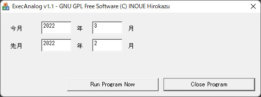

## ExecAnalog（Analogに今月・先月のログ解析をさせるための自動化ツール）(Windows)<!-- omit in toc -->

[Home](https://oasis3855.github.io/webpage/) > [Software](https://oasis3855.github.io/webpage/software/index.html) > [Software Download](https://oasis3855.github.io/webpage/software/software-download.html) > [webserver_tools](../README.md) > ***exec_analog*** (this page)

<br />
<br />

Last Updated : Jul. 2007 -- ***this is discontinued software 開発終了***

<br />
<br />

## ソフトウエアのダウンロード

-    [このGitHubリポジトリを参照する（ソースコード, 実行ファイル）](../exec_analog/) 

-    [Googleドライブを参照する（ソースコード, 実行ファイル）](https://docs.google.com/open?id=0B7BSijZJ2TAHNzlhNWMxNmUtYmNjOS00ZjI5LTk0MWEtYTM3MmU0ZTEyNGI0) 

## 概要

このプログラムは、ログ解析ツール[Analog](https://en.wikipedia.org/wiki/Analog_(program))に、今月および前月のログを解析させるための自動化ツールです。

設定ファイル（ExecAnalog.ini）の各項目を、ユーザ環境に合わせて調整してください。

また、Analogの配布パッケージに含まれているanalog.cfgをもとにして、テンプレートファイル「analog.cfg.tmpl（ExecAnalog.iniファイルで任意のファイル名に変更可能）」を作成します。出力パス名と入力ファイルパターンの行を"$$OUTFILE$$", "$$LOGFILE$$"とします。

たとえば、$$LOGFILE$$ は 「LOGFILE c:\inetpub\logs\iis\ex0707*.log」のように変換されます。

出力パスには、あらかじめAnalogで必要な画像ファイル類（imagesサブディレクトリ内）を転送しておくのをお忘れなく。（このプログラムはそこまで面倒を見ません）

### GUIで手動実行する



ExecAnalog実行画面

### コマンドラインから実行する

引数を何かつけると、設定ファイル（ExecAnalog.ini）の設定値でAnalogを実行します。

タスクスケジューラなどで自動実行・定期実行する場合はこの方法を用います。

```
ExecAnalog.exe /auto
```

## 設定ファイル（ExecAnalog.ini）について

プログラムを初めて実行すると、自動的に設定ファイル（ExecAnalog.ini）のテンプレートが同じディレクトリに作成されます。これをユーザ環境に合わせて編集します。

```INI
[ExecAnalog]
install=installed (do not delete this line)
OutputDir=d:\Inetpub\wwwroot\analog\
AnalogDir=c:\Program Files\analog\
AnalogProgName=analog.exe
AnalogCfgTemplate=analog.cfg.tmpl
IISLogDir=d:\Inetpub\Log\
IISLogName=ex%02d%02d*.log
```

## analog.cfgのテンプレートファイル（analog.cfg.tmpl）について

Analogの配布パッケージ（analog_60w32.zip）に含まれているanalog.cfgは次のようになっている（一部抜粋）

```INI
LOGFILE logfile.log
# LOGFILE C:\old\logs\access_log.*
OUTFILE Report.html
HOSTNAME "[my organisation]"
#
```

次のように変更して、analog.cfg.tmplとしてanalog.exeと同じディレクトリに保存する。

```INI
$$LOGFILE$$
# LOGFILE C:\old\logs\access_log.*
$$OUTFILE$$
HOSTNAME "[my organisation]"
#
```

ExecAnalog.exe はテンプレートファイルより、次のようなanalog.cfgを作成する。

```INI
LOGFILE d:\Inetpub\Log\ex2202*.log
# LOGFILE C:\old\logs\access_log.*
OUTFILE d:\Inetpub\wwwroot\analog\log.html
HOSTNAME "[my organisation]"
#
```

## 動作確認済み

- Windows 2003 Server
- Windows XP
- [Analog](https://en.wikipedia.org/wiki/Analog_(program)) 6.0

## バージョン情報

- Version 1.0 (2007/07/25)

## ライセンス

このスクリプトは [GNU General Public License v3ライセンスで公開する](https://gpl.mhatta.org/gpl.ja.html) フリーソフトウエア

