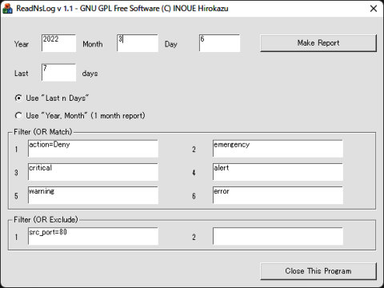

## ReadNsLog（NetScreenのログからエラー行を抽出するツール）(Windows)<!-- omit in toc -->

[Home](https://oasis3855.github.io/webpage/) > [Software](https://oasis3855.github.io/webpage/software/index.html) > [Software Download](https://oasis3855.github.io/webpage/software/software-download.html) > [webserver_tools](../README.md) > ***read_netscreen_log*** (this page)

<br />
<br />

Last Updated : Jul. 2007 -- ***this is discontinued software 開発終了***

- [ソフトウエアのダウンロード](#ソフトウエアのダウンロード)
- [概要](#概要)
  - [GUIで手動実行する](#guiで手動実行する)
  - [コマンドラインから実行する](#コマンドラインから実行する)
  - [設定ファイル（AutoLogParser.ini）について](#設定ファイルautologparseriniについて)
- [動作確認済み](#動作確認済み)
- [バージョン情報](#バージョン情報)
- [ライセンス](#ライセンス)

<br />
<br />

## ソフトウエアのダウンロード

-    [このGitHubリポジトリを参照する（ソースコード, 実行ファイル）](../read_netscreen_log/) 

-    [Googleドライブを参照する（ソースコード, 実行ファイル）](https://docs.google.com/open?id=0B7BSijZJ2TAHNzlhNWMxNmUtYmNjOS00ZjI5LTk0MWEtYTM3MmU0ZTEyNGI0) 

## 概要

Syslogに書き込まれたNetScreen（ファイアウォール機器）のログファイルから、エラーや警告などのログ行を抜き出してテキスト化するツールです。

NetScrenに接続してログを収集するのではなく、すでにローカルマシン上に書き出されているsyslogファイル（テキストファイル）から、必要なログ行を抽出するツールです。

### GUIで手動実行する



ReadNsLog実行画面

### コマンドラインから実行する

引数を何かつけると、設定ファイル（ReadNsLog.ini）の設定値でSyslogより抽出・テキスト化を実行します。

タスクスケジューラなどで自動実行・定期実行する場合はこの方法を用います。

```
ReadNsLog.exe /auto
```

### 設定ファイル（AutoLogParser.ini）について

プログラムを初めて実行すると、自動的に設定ファイル（ReadNsLog.ini）のテンプレートが同じディレクトリに作成されます。これをユーザ環境に合わせて編集します。


```INI
[ReadNsLog]
install=installed (do not delete this line)
OutputDir=d:\Inetpub\wwwroot\
OutputFileName=NetscreenQuery.txt
SyslogDir=d:\Syslog\
SyslogFileName=Syslog-%d-%02d-%02d.log
MatchString1=action=Deny
MatchString2=emergency
MatchString3=critical
MatchString4=alert
MatchString5=warning
MatchString6=error
ExcludeString1=src_port=80
ExcludeString2=
Days=7
```

## 動作確認済み

- Windows 2003 Server
- Windows XP
- NetScreenより出力されたsyslogテキスト

## バージョン情報

- Version 1.0 (2007/07/25)

## ライセンス

このスクリプトは [GNU General Public License v3ライセンスで公開する](https://gpl.mhatta.org/gpl.ja.html) フリーソフトウエア
