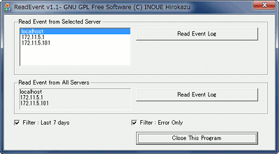
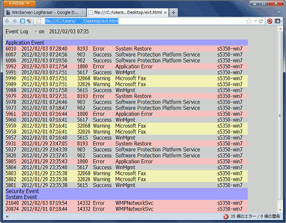

## ReadEvent（Windowsイベント ログからエラー行を抽出しHTML化するツール）(Windows)<!-- omit in toc -->

[Home](https://oasis3855.github.io/webpage/) > [Software](https://oasis3855.github.io/webpage/software/index.html) > [Software Download](https://oasis3855.github.io/webpage/software/software-download.html) > [webserver_tools](../README.md) > ***read_windows_event*** (this page)

<br />
<br />

Last Updated : Feb. 2012 -- ***this is discontinued software 開発終了***

- [ソフトウエアのダウンロード](#ソフトウエアのダウンロード)
- [概要](#概要)
  - [GUIで手動実行する](#guiで手動実行する)
  - [コマンドラインから実行する](#コマンドラインから実行する)
  - [設定ファイル（ReadEvent.ini）について](#設定ファイルreadeventiniについて)
  - [出力HTMLの例](#出力htmlの例)
- [動作確認済み](#動作確認済み)
- [バージョン情報](#バージョン情報)

<br />
<br />

## ソフトウエアのダウンロード

-    [このGitHubリポジトリを参照する（ソースコード, 実行ファイル）](../read_windows_event/) 

-    [Googleドライブを参照する（ソースコード, 実行ファイル）](https://docs.google.com/open?id=0B7BSijZJ2TAHNzlhNWMxNmUtYmNjOS00ZjI5LTk0MWEtYTM3MmU0ZTEyNGI0) 

## 概要

このプログラムは、Windowsのイベントログからエラー等の行を抽出しHTML化するツールです。

また、Symantec Backup Exec の動作ログを抽出することもできます。

### GUIで手動実行する



ReadEvent実行画面

サーバ名の先頭1文字が「*」（アスタリスク）のものは、Symantec Backup Exec の動作ログ抽出対象のサーバ

### コマンドラインから実行する

引数を何かつけると、設定ファイル（ReadEvent.ini）の設定値でWindowsのイベント抽出を実行します。

タスクスケジューラなどで自動実行・定期実行する場合はこの方法を用います。

```
ReadEvent.exe /auto
```

### 設定ファイル（ReadEvent.ini）について

プログラムを初めて実行すると、自動的に設定ファイル（ReadEvent.ini）のテンプレートが同じディレクトリに作成されます。これをユーザ環境に合わせて編集します。

```INI
[ReadEvent]
install=installed (do not delete this line)
OutputDir=d:\Inetpub\wwwroot\        ← 結果出力ディレクトリ
TargetName1=localhost
TargetName2=192.168.1.1
TargetName3=MYMACHINE
TargetName4=
TargetName5=
TargetBackupExecName=192.168.1.1        ← 空欄にすると処理除外
BackupExecNameString=BackupExec
swErrorOnly=YES
swLast7Days=YES
```

### 出力HTMLの例



出力HTMLの例

## 動作確認済み

- Windows 2003 Server
- Windows XP

## バージョン情報

- Version 1.0 (2007/07/25)

