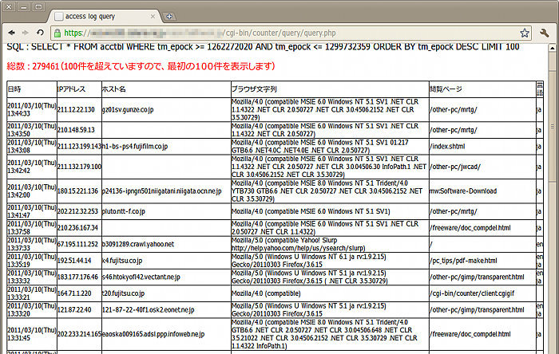

## Webページ用アクセスログ記録とログ検索スクリプト (Linux, BSD)<!-- omit in toc -->

[Home](https://oasis3855.github.io/webpage/) > [Software](https://oasis3855.github.io/webpage/software/index.html) > [Software Download](https://oasis3855.github.io/webpage/software/software-download.html) > [webserver_tools](../README.md) > ***web-access-counter*** (this page)

<br />
<br />

Last Updated : Jan. 2013 -- ***this is discontinued software 開発終了***

- [ソフトウエアのダウンロード](#ソフトウエアのダウンロード)
- [概要](#概要)
- [Webページ（HTMLファイル内）での設置方法](#webページhtmlファイル内での設置方法)
- [クエリー表示例、集計表示例](#クエリー表示例集計表示例)
- [動作確認済み](#動作確認済み)
- [バージョン情報](#バージョン情報)
- [ライセンス](#ライセンス)

<br />
<br />

## ソフトウエアのダウンロード

-    [このGitHubリポジトリを参照する（ソースコード, 実行ファイル）](../web-access-counter/) 

## 概要

webページを表示した端末のログをSQLite3（SQLデータベース）に記録し、またその記録を検索するためのスクリプト集。作者のWebページで10年以上、実際に利用中のスクリプト。

サーバ側のスクリプト（clieng.cgi）をクライアントからアクセスさせることで、環境変数（アクセス元IPアドレス REMOTE_ADDR、アクセス元ホスト名 REMOTE_HOST、ブラウザ名とOS名を含むユーザエージェント文字列 HTTP_USER_AGENT、アクセスされたHTMLファイル名 HTTP_REFERER）を得ることができる。

このデータを収集し、SQLデータベースに格納するのがサーバ側のスクリプト（clieng.cgi）の役割だ。

そして、このSQLデータベースを検索・表示するクエリー用スクリプトがquery.phpです。

さらに、cronなどでstat_monthly.plを実行することで、月次集計htmlを出力することができる。

## Webページ（HTMLファイル内）での設置方法

1x1の透明GIF画像を表示するスクリプトを用いています。

```html
<!-- Access Counter -->

<!--  Access Counter -->
```

## クエリー表示例、集計表示例


クエリー 初期メニュー画面 (query.php)



アクセスログの検索結果画面 (query.php)


集計表事例 (stat_monthly.plで出力されたhtml)

## 動作確認済み

- Free BSD 9.1, Perl 5.14

## バージョン情報

- Version 2.0 (2011/03/24)

- Version 2.1 (2011/03/24)

- Version 2.2 (2011/03/24)

- Version 3.0 (2011/03/24)
  - utf8化

- Version 3.1 (2011/04/02)
  -  設定ファイル include/setup.pl 追加

- Version 3.0.1 (2012/06/24)
  -  stat_monthly.pl : Google Chart Tool API verup

- Version 3.1 (2012/06/26)
  -  stat_monthly.pl : ApacheLog解析のDBより、総アクセス数を得る
  -  sql ブラウザ/OS定義変更
  -  import/export/delete admin script UTF-8化

- Version 3.1 (2013/01/01)
  -  import_year_data.pl : 同一日,IPアドレスのデータが見つかった場合、継続か終了を選択可能にした

## ライセンス

このスクリプトは [GNU General Public License v3ライセンスで公開する](https://gpl.mhatta.org/gpl.ja.html) フリーソフトウエア

